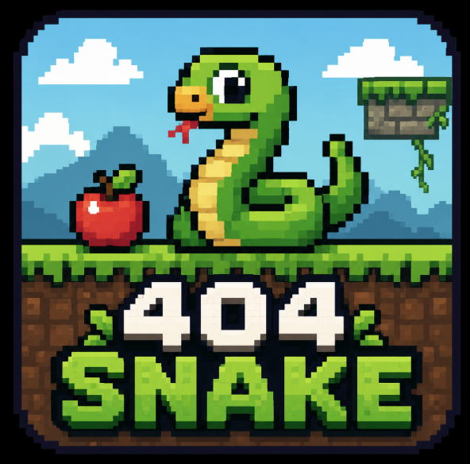

# final-project-404nation
This is a Snakebird-style puzzle game for the Interactive Graphics final project.
## Play the Game
Coming soon...
## How to Run
Install dependencies:
```bash
npm install
```
Start the development server:
```bash
npm run dev
```
## Controls

| Key | Action |
|------|------|
| W | Move Up |
| A | Move Left |
| S | Move Down |
| D | Move Right |
## Levels
Three custom levels are provided:
- Level 1
- Level 2
- Level 3

The level files are stored in the `levels/` folder.
## Level Format
Each level is stored as a JSON file.
Example:
```json
{
  "id": "level-1",
  "name": "guide",
  "grid": [
    "........",
    "....F...",
    "....#E..",
    "........",
    "########"
  ],
  "snake": [[2,3],[1,3]],
  "facing": "right"
}
```
### Fields
| Field | Description |
|---------|---------|
| id | Unique level identifier |
| name | Level name |
| grid | Level map represented by characters |
| snake | Initial snake coordinates, head first |
| facing | Initial snake direction |
### Cell Types
| Symbol | Meaning |
|---------|---------|
| # | Wall |
| . | Empty space |
| F | Fruit |
| ^ | Spikes |
| E | Exit |
## Level Validation
The level loader validates:
- Grid existence
- Snake existence
- Facing existence
- Non-empty snake
- Valid cell types
## Technologies Used
- JavaScript
- Three.js
- Vite